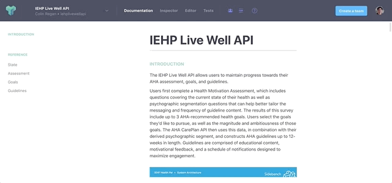
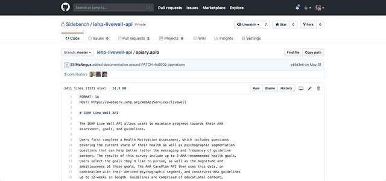
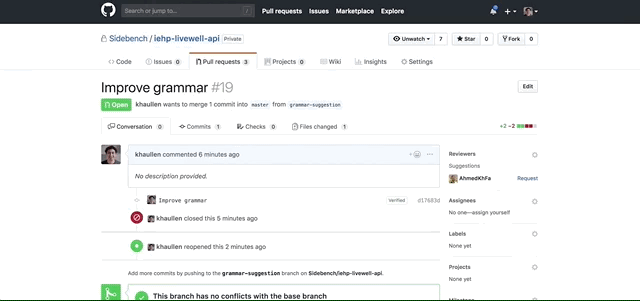

# API Design Collaboration

In previous client projects that required collaborative API design (i.e. _American Heart Association_, _IEHP_, _Department of Children and Family Services_, etc.), Sidebench utilized the API documentation platform [Apiary](https://apiary.io/), in conjunction with [Github](https://github.com/), to effectively draft, revise, and maintain the documentation from project inception through implementation. A wide variety of stakeholders used the documentation to align on functionality and scope, including both client and server-side software developers as well as non-technical audiences like product managers, UI designers, and company executives.

From a technical standpoint, Apiary stands out as a capable [API Blueprint](https://apiblueprint.org/) visual editor, a one-click mock server, as well as API inspector and test harness. For non-technical stakeholders, it provides an intuitive visual and interactive interface for viewing API documentation.

Because Apiary also features two-way syncing with Github, we're able to leverage Github's built in collaboration tools called [Pull Requests](https://help.github.com/articles/github-glossary/#pull-request).

Pull Requests allow any collaborator to propose a change to the documentation, giving all stakeholders the chance to review and discuss the change, revising as needed before accepting the modification.

The combination of the two tools offers a seamless experience for collaboration on API design, eliminating the possibility of miscommunication, whether for technical or functional API requirements.
